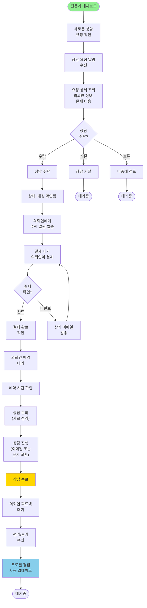
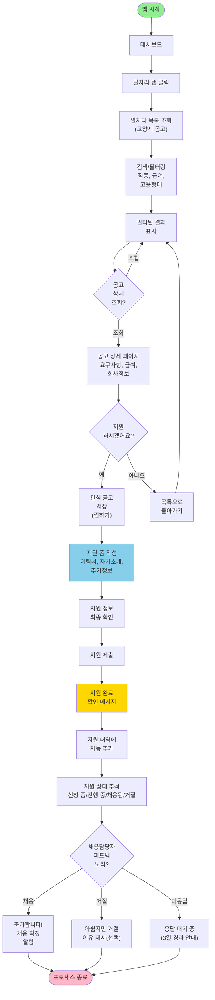
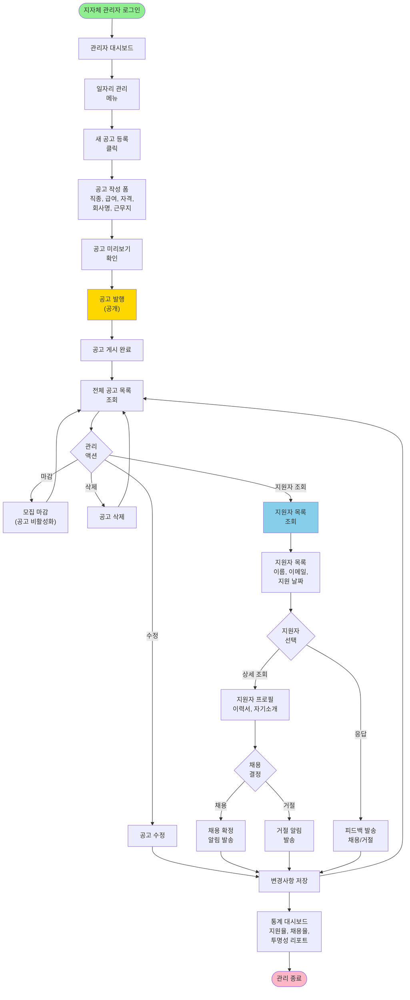
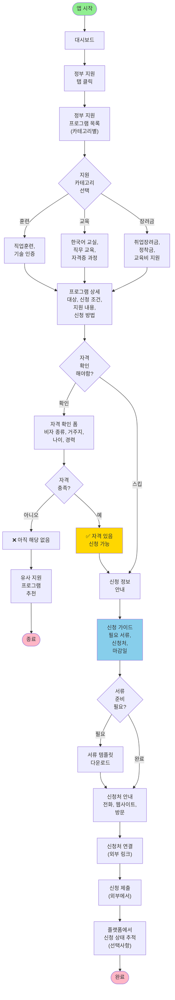

# easyK User Flow (사용자 흐름도)

**문서 버전**: v1.0  
**작성일**: 2025-12-30  
**프로젝트**: easyK (외국인 맞춤형 정착 지원 플랫폼)

---

## User Flow 개요

이 문서는 easyK 플랫폼의 **3가지 핵심 사용자 여정(User Journey)**을 시각화합니다.
- FEAT-1: 법률 상담 신청 및 매칭
- FEAT-2: 일자리 검색 및 지원
- FEAT-3: 정부 지원 정보 조회

각 흐름은 사용자가 목표를 달성하는 전체 경로와 분기점(의사결정 지점)을 포함합니다.

---

## 1. FEAT-1: 법률 상담 신청 & 매칭 흐름

### 외국인 사용자 - 상담 신청 흐름

```mermaid
graph TD
    Start([앱 시작]) --> CheckLogin{로그인<br/>되었나?}
    
    CheckLogin -->|아니오| Login[로그인/회원가입]
    Login --> ProfileSetup[프로필 작성<br/>국적, 비자종류, 언어]
    ProfileSetup --> ProfileSaved[프로필 저장]
    
    CheckLogin -->|예| Dashboard[대시보드]
    ProfileSaved --> Dashboard
    
    Dashboard --> ConsultRequest[상담 신청<br/>클릭]
    ConsultRequest --> SelectType{상담<br/>유형<br/>선택}
    
    SelectType -->|비자 관련| VisaForm["비자 상담 폼<br/>(문제 입력,<br/>희망 변호사)"]
    SelectType -->|근로 관련| LaborForm["근로 상담 폼<br/>(계약, 임금, 분쟁)"]
    SelectType -->|계약/기타| ContractForm["기타 상담 폼"]
    
    VisaForm --> SubmitForm["상담 내용 확인<br/>& 제출"]
    LaborForm --> SubmitForm
    ContractForm --> SubmitForm
    
    SubmitForm --> Processing["상담 신청 처리<br/>(DB 저장)"]
    Processing --> Matching["변호사 자동<br/>조건 기반 매칭"]
    
    Matching --> NotifyWaiting["신청자에게<br/>대기 안내 알림<br/>(이메일)"]
    NotifyWaiting --> WaitingState["상태: 매칭 대기중"]
    
    WaitingState --> ConsultantAccept{변호사가<br/>수락?}
    
    ConsultantAccept -->|승인| AcceptNotify["신청자에게<br/>승인 알림<br/>+ 예약 화면"]
    ConsultantAccept -->|거절| RejectedNotify["거절 알림<br/>+ 대체 변호사<br/>재추천"]
    
    RejectedNotify --> WaitingState
    
    AcceptNotify --> Schedule["상담 예약<br/>(날짜/시간 선택)"]
    Schedule --> PaymentReady["결제 화면<br/>상담료: 예정 가격"]
    
    PaymentReady --> PaymentGateway["결제 게이트웨이<br/>(토스)"]
    PaymentGateway --> PaymentCheck{결제<br/>성공?}
    
    PaymentCheck -->|실패| PaymentFail["결제 실패 안내<br/>& 재시도"]
    PaymentFail --> PaymentReady
    
    PaymentCheck -->|성공| PaymentSuccess["결제 완료"]
    PaymentSuccess --> Confirmation["예약 확정<br/>확인 이메일 발송"]
    
    Confirmation --> WaitingConsult["상담 예정일까지<br/>대기"]
    WaitingConsult --> ConsultationDay["상담 진행<br/>(이메일/문서 교환)"]
    
    ConsultationDay --> ConsultComplete["상담 완료"]
    ConsultComplete --> ReviewPrompt["평가 및 후기<br/>작성 유도"]
    
    ReviewPrompt --> ReviewSubmit{후기<br/>작성?}
    ReviewSubmit -->|작성| Review["⭐ 평점/리뷰 작성"]
    ReviewSubmit -->|미작성| NoReview["스킵"]
    
    Review --> End([완료])
    NoReview --> End
    
    style Start fill:#90EE90
    style End fill:#FFB6C6
    style Processing fill:#87CEEB
    style ConsultComplete fill:#FFD700
```

---

### 전문가(변호사) - 상담 요청 수락 흐름

---

## 2. FEAT-2: 일자리 검색 & 지원 흐름

### 외국인 사용자 - 일자리 검색 및 지원

---

### 지자체 담당자 - 일자리 공고 관리

---

## 3. FEAT-3: 정부 지원 정보 조회 흐름

### 외국인 사용자 - 정부 지원 조회

---

## 사용자 여정 요약 (User Journey Map)

### 터치포인트별 통증점 & 해결책

| Phase | 터치포인트 | 사용자 통증 | easyK 해결책 |
|-------|-----------|-----------|------------|
| **인식(Awareness)** | 플랫폼 발견 | "어디서 찾나?" | 지자체/커뮤니티 마케팅 |
| **가입(Registration)** | 회원가입 | "복잡하고 오래 걸려" | 3 필드 최소 가입, 소셜 로그인 |
| **탐색(Exploration)** | 대시보드 | "뭘 해야 하지?" | 직관적 네비게이션, 가이드 투어 |
| **신청(Application)** | 폼 작성 | "무슨 정보를 써야?" | 예시 텍스트, 필수/선택 표시 |
| **대기(Waiting)** | 매칭 대기 | "얼마나 기다려야?" | 실시간 상태 업데이트, 예상 시간 안내 |
| **결제(Payment)** | 결제 게이트웨이 | "안전한가?" | 신뢰 배지, 환불 정책 명시 |
| **소비(Consumption)** | 상담 진행 | "어떻게 진행되나?" | 확인 이메일, 가이드 제공 |
| **평가(Feedback)** | 후기 작성 | "시간이 없어" | 모바일 최적화, 짧은 양식 |

---

**문서 관리**  
- 최종 검토: 제품팀, UX 팀
- 버전 관리: 기능 추가 시 User Flow 업데이트
- 변경 이력: 사용자 피드백 반영 시 기록
