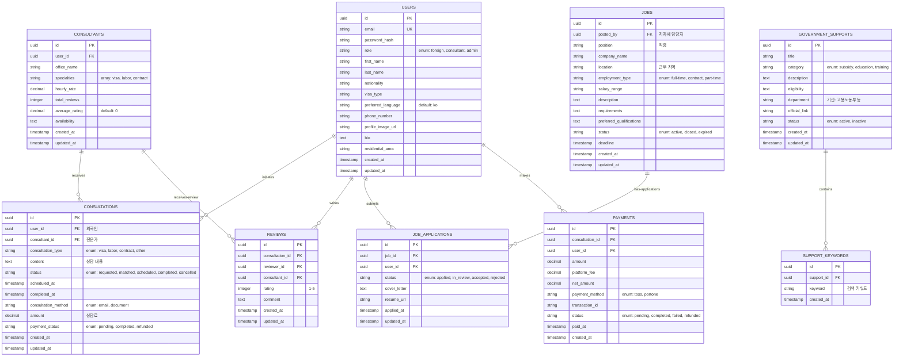

# easyK Database Design (데이터베이스 설계)

**문서 버전**: v1.0  
**작성일**: 2025-12-30  
**프로젝트**: easyK (외국인 맞춤형 정착 지원 플랫폼)  
**데이터베이스**: PostgreSQL (Supabase)

---

## 데이터베이스 설계 개요

easyK의 데이터모델은 **관계형(Relational) 구조**로 다음 핵심 엔티티를 포함합니다:
- 사용자 관리 (Users, Consultants)
- 상담 프로세스 (Consultations, Reviews, Payments)
- 일자리 (Jobs, Job_Applications)
- 정부 지원 (Government_Supports)

모든 테이블은 표준 SQL로 작성되며, Supabase PostgreSQL에 배포됩니다.

---

## 엔티티 관계도 (ERD)



---

## 상세 테이블 정의

### 1. Users (사용자)

**목적**: 플랫폼의 모든 사용자(외국인, 전문가, 관리자) 정보 저장

```sql
CREATE TABLE users (
    id UUID PRIMARY KEY DEFAULT gen_random_uuid(),
    
    -- 인증 정보
    email VARCHAR(255) UNIQUE NOT NULL,
    password_hash VARCHAR(255) NOT NULL,
    email_verified BOOLEAN DEFAULT FALSE,
    email_verified_at TIMESTAMP,
    
    -- 역할
    role VARCHAR(50) NOT NULL DEFAULT 'foreign'
        CHECK (role IN ('foreign', 'consultant', 'admin')),
    
    -- 개인정보
    first_name VARCHAR(100) NOT NULL,
    last_name VARCHAR(100) NOT NULL,
    nationality VARCHAR(100),
    date_of_birth DATE,
    gender VARCHAR(20),
    
    -- 외국인 관련
    visa_type VARCHAR(100) COMMENT '비자 유형: E-1, D-2, F-2 등',
    visa_expiration DATE,
    preferred_language VARCHAR(10) DEFAULT 'ko' COMMENT '선호 언어: ko, en',
    
    -- 연락처
    phone_number VARCHAR(20),
    phone_verified BOOLEAN DEFAULT FALSE,
    
    -- 프로필
    profile_image_url VARCHAR(500),
    bio TEXT,
    residential_area VARCHAR(100) COMMENT '거주 지역: 고양시 덕양구 등',
    
    -- 타임스탬프
    created_at TIMESTAMP NOT NULL DEFAULT CURRENT_TIMESTAMP,
    updated_at TIMESTAMP NOT NULL DEFAULT CURRENT_TIMESTAMP,
    last_login TIMESTAMP,
    
    -- 인덱스
    CONSTRAINT email_format CHECK (email ~* '^[A-Za-z0-9._%+-]+@[A-Za-z0-9.-]+\.[A-Z|a-z]{2,}$')
);

-- 인덱스
CREATE INDEX idx_users_email ON users(email);
CREATE INDEX idx_users_role ON users(role);
CREATE INDEX idx_users_nationality ON users(nationality);
CREATE INDEX idx_users_residential_area ON users(residential_area);
```

---

### 2. Consultants (전문가)

**목적**: 법률 전문가(변호사, 세무사 등) 프로필 및 평가 정보

```sql
CREATE TABLE consultants (
    id UUID PRIMARY KEY DEFAULT gen_random_uuid(),
    user_id UUID NOT NULL UNIQUE REFERENCES users(id) ON DELETE CASCADE,
    
    -- 사무실 정보
    office_name VARCHAR(200) NOT NULL,
    office_phone VARCHAR(20),
    office_address VARCHAR(300),
    years_experience INTEGER,
    
    -- 전문 분야 (배열로 저장)
    specialties TEXT[] NOT NULL DEFAULT '{}' 
        COMMENT '배열: [visa, labor, contract, business]',
    
    -- 요금
    hourly_rate DECIMAL(10, 2) NOT NULL DEFAULT 100000.00
        COMMENT '시간당 상담료 (원)',
    
    -- 평가
    total_reviews INTEGER DEFAULT 0,
    average_rating DECIMAL(3, 2) DEFAULT 0.00
        CHECK (average_rating >= 0 AND average_rating <= 5),
    
    -- 가용성
    availability TEXT COMMENT 'JSON: {"mon": "09:00-18:00", ...}',
    max_consultations_per_day INTEGER DEFAULT 5,
    
    -- 상태
    is_active BOOLEAN DEFAULT TRUE,
    is_verified BOOLEAN DEFAULT FALSE,
    
    -- 타임스탐프
    created_at TIMESTAMP NOT NULL DEFAULT CURRENT_TIMESTAMP,
    updated_at TIMESTAMP NOT NULL DEFAULT CURRENT_TIMESTAMP
);

-- 인덱스
CREATE INDEX idx_consultants_user_id ON consultants(user_id);
CREATE INDEX idx_consultants_specialties ON consultants USING GIN(specialties);
CREATE INDEX idx_consultants_is_active ON consultants(is_active);
CREATE INDEX idx_consultants_average_rating ON consultants(average_rating DESC);
```

---

### 3. Consultations (상담 신청)

**목적**: 외국인과 전문가 간의 상담 신청 및 진행 상황 추적

```sql
CREATE TABLE consultations (
    id UUID PRIMARY KEY DEFAULT gen_random_uuid(),
    user_id UUID NOT NULL REFERENCES users(id) ON DELETE CASCADE,
    consultant_id UUID REFERENCES consultants(id) ON DELETE SET NULL,
    
    -- 상담 정보
    consultation_type VARCHAR(100) NOT NULL
        CHECK (consultation_type IN ('visa', 'labor', 'contract', 'business', 'other')),
    content TEXT NOT NULL COMMENT '상담 요청 내용',
    
    -- 상태 추적
    status VARCHAR(50) NOT NULL DEFAULT 'requested'
        CHECK (status IN ('requested', 'matched', 'scheduled', 'in_progress', 'completed', 'cancelled')),
    
    -- 예약 정보
    scheduled_at TIMESTAMP COMMENT '예약된 상담 날짜/시간',
    completed_at TIMESTAMP COMMENT '상담 완료 날짜/시간',
    consultation_method VARCHAR(50) NOT NULL DEFAULT 'email'
        CHECK (consultation_method IN ('email', 'document', 'call', 'video')),
    
    -- 요금
    amount DECIMAL(10, 2) NOT NULL COMMENT '상담료',
    
    -- 결제 상태
    payment_status VARCHAR(50) NOT NULL DEFAULT 'pending'
        CHECK (payment_status IN ('pending', 'completed', 'failed', 'refunded')),
    
    -- 타임스탐프
    created_at TIMESTAMP NOT NULL DEFAULT CURRENT_TIMESTAMP,
    updated_at TIMESTAMP NOT NULL DEFAULT CURRENT_TIMESTAMP,
    
    -- 제약
    CONSTRAINT valid_dates CHECK (scheduled_at > created_at OR scheduled_at IS NULL)
);

-- 인덱스
CREATE INDEX idx_consultations_user_id ON consultations(user_id);
CREATE INDEX idx_consultations_consultant_id ON consultations(consultant_id);
CREATE INDEX idx_consultations_status ON consultations(status);
CREATE INDEX idx_consultations_created_at ON consultations(created_at DESC);
CREATE INDEX idx_consultations_payment_status ON consultations(payment_status);
```

---

### 4. Reviews (평가)

**목적**: 상담 후 외국인이 전문가에게 부여하는 평가 및 리뷰

```sql
CREATE TABLE reviews (
    id UUID PRIMARY KEY DEFAULT gen_random_uuid(),
    consultation_id UUID NOT NULL UNIQUE REFERENCES consultations(id) ON DELETE CASCADE,
    reviewer_id UUID NOT NULL REFERENCES users(id) ON DELETE CASCADE,
    consultant_id UUID NOT NULL REFERENCES consultants(id) ON DELETE CASCADE,
    
    -- 평가
    rating INTEGER NOT NULL DEFAULT 5
        CHECK (rating >= 1 AND rating <= 5) COMMENT '1~5 별점',
    comment TEXT COMMENT '리뷰 텍스트 (최대 500자)',
    
    -- 메타데이터
    is_anonymous BOOLEAN DEFAULT FALSE,
    helpful_count INTEGER DEFAULT 0,
    
    -- 타임스탐프
    created_at TIMESTAMP NOT NULL DEFAULT CURRENT_TIMESTAMP,
    updated_at TIMESTAMP NOT NULL DEFAULT CURRENT_TIMESTAMP
);

-- 인덱스
CREATE INDEX idx_reviews_consultant_id ON reviews(consultant_id);
CREATE INDEX idx_reviews_reviewer_id ON reviews(reviewer_id);
CREATE INDEX idx_reviews_rating ON reviews(rating);
CREATE INDEX idx_reviews_created_at ON reviews(created_at DESC);
```

---

### 5. Payments (결제)

**목적**: 상담료 결제 기록 및 수익 분배 추적

```sql
CREATE TABLE payments (
    id UUID PRIMARY KEY DEFAULT gen_random_uuid(),
    consultation_id UUID NOT NULL UNIQUE REFERENCES consultations(id) ON DELETE CASCADE,
    user_id UUID NOT NULL REFERENCES users(id) ON DELETE CASCADE,
    
    -- 금액
    amount DECIMAL(10, 2) NOT NULL COMMENT '결제 금액 (원)',
    platform_fee DECIMAL(10, 2) NOT NULL COMMENT '플랫폼 수수료 (5%)',
    net_amount DECIMAL(10, 2) NOT NULL COMMENT '전문가 수익 (95%)',
    
    -- 결제 방식
    payment_method VARCHAR(50) NOT NULL
        CHECK (payment_method IN ('toss', 'portone', 'card', 'transfer')),
    transaction_id VARCHAR(100) UNIQUE COMMENT '결제 게이트웨이 거래번호',
    
    -- 상태
    status VARCHAR(50) NOT NULL DEFAULT 'pending'
        CHECK (status IN ('pending', 'completed', 'failed', 'refunded', 'cancelled')),
    
    -- 타임스탬프
    paid_at TIMESTAMP COMMENT '결제 완료 시각',
    refunded_at TIMESTAMP COMMENT '환불 완료 시각',
    created_at TIMESTAMP NOT NULL DEFAULT CURRENT_TIMESTAMP,
    updated_at TIMESTAMP NOT NULL DEFAULT CURRENT_TIMESTAMP,
    
    -- 제약
    CONSTRAINT valid_amounts CHECK (amount > 0 AND net_amount >= 0 AND platform_fee >= 0)
);

-- 인덱스
CREATE INDEX idx_payments_user_id ON payments(user_id);
CREATE INDEX idx_payments_status ON payments(status);
CREATE INDEX idx_payments_paid_at ON payments(paid_at DESC);
CREATE INDEX idx_payments_transaction_id ON payments(transaction_id);
```

---

### 6. Jobs (일자리)

**목적**: 지자체가 등록한 채용 공고

```sql
CREATE TABLE jobs (
    id UUID PRIMARY KEY DEFAULT gen_random_uuid(),
    posted_by UUID NOT NULL REFERENCES users(id) ON DELETE CASCADE
        COMMENT '지자체 담당자',
    
    -- 공고 정보
    position VARCHAR(200) NOT NULL COMMENT '직종',
    company_name VARCHAR(200) NOT NULL,
    company_phone VARCHAR(20),
    company_address VARCHAR(300),
    location VARCHAR(100) NOT NULL COMMENT '근무 지역',
    
    -- 고용 정보
    employment_type VARCHAR(50) NOT NULL DEFAULT 'full-time'
        CHECK (employment_type IN ('full-time', 'contract', 'part-time', 'temporary')),
    salary_range VARCHAR(100) COMMENT '예: 2,500만원~3,000만원',
    salary_currency VARCHAR(10) DEFAULT 'KRW',
    
    -- 공고 상세
    description TEXT NOT NULL COMMENT '업무 설명',
    requirements TEXT COMMENT '필수 요구사항',
    preferred_qualifications TEXT COMMENT '우대사항',
    benefits TEXT COMMENT '복리후생',
    
    -- 언어 요구
    required_languages TEXT[] DEFAULT '{}' COMMENT '배열: [ko, en, zh]',
    
    -- 상태
    status VARCHAR(50) NOT NULL DEFAULT 'active'
        CHECK (status IN ('active', 'closed', 'expired', 'draft')),
    
    -- 마감
    deadline TIMESTAMP NOT NULL,
    created_at TIMESTAMP NOT NULL DEFAULT CURRENT_TIMESTAMP,
    updated_at TIMESTAMP NOT NULL DEFAULT CURRENT_TIMESTAMP,
    
    CONSTRAINT valid_deadline CHECK (deadline > created_at)
);

-- 인덱스
CREATE INDEX idx_jobs_posted_by ON jobs(posted_by);
CREATE INDEX idx_jobs_status ON jobs(status);
CREATE INDEX idx_jobs_location ON jobs(location);
CREATE INDEX idx_jobs_deadline ON jobs(deadline);
CREATE INDEX idx_jobs_employment_type ON jobs(employment_type);
```

---

### 7. Job_Applications (지원)

**목적**: 외국인의 일자리 지원 기록

```sql
CREATE TABLE job_applications (
    id UUID PRIMARY KEY DEFAULT gen_random_uuid(),
    job_id UUID NOT NULL REFERENCES jobs(id) ON DELETE CASCADE,
    user_id UUID NOT NULL REFERENCES users(id) ON DELETE CASCADE,
    
    -- 지원 정보
    status VARCHAR(50) NOT NULL DEFAULT 'applied'
        CHECK (status IN ('applied', 'in_review', 'interview', 'accepted', 'rejected')),
    
    cover_letter TEXT COMMENT '자기소개서',
    resume_url VARCHAR(500) COMMENT '이력서 파일 URL',
    
    -- 반응
    reviewer_comment TEXT COMMENT '채용담당자 피드백',
    
    -- 타임스탐프
    applied_at TIMESTAMP NOT NULL DEFAULT CURRENT_TIMESTAMP,
    reviewed_at TIMESTAMP COMMENT '검토 완료 시각',
    updated_at TIMESTAMP NOT NULL DEFAULT CURRENT_TIMESTAMP,
    
    -- 제약
    UNIQUE(job_id, user_id) COMMENT '중복 지원 방지'
);

-- 인덱스
CREATE INDEX idx_applications_job_id ON job_applications(job_id);
CREATE INDEX idx_applications_user_id ON job_applications(user_id);
CREATE INDEX idx_applications_status ON job_applications(status);
CREATE INDEX idx_applications_applied_at ON job_applications(applied_at DESC);
```

---

### 8. Government_Supports (정부 지원)

**목적**: 정부 부처의 지원 프로그램 정보

```sql
CREATE TABLE government_supports (
    id UUID PRIMARY KEY DEFAULT gen_random_uuid(),
    
    -- 프로그램 정보
    title VARCHAR(200) NOT NULL,
    category VARCHAR(50) NOT NULL
        CHECK (category IN ('subsidy', 'education', 'training', 'visa', 'housing')),
    description TEXT NOT NULL,
    
    -- 자격 조건
    eligibility TEXT COMMENT '대상 조건 설명',
    eligible_visa_types TEXT[] DEFAULT '{}' COMMENT '배열: [E-1, D-2, F-2, ...]',
    
    -- 지원 내용
    support_content TEXT COMMENT '지원 내용 (금액, 교육 시간 등)',
    
    -- 담당 기관
    department VARCHAR(100) NOT NULL COMMENT '고용노동부, 중소벤처기업부 등',
    department_phone VARCHAR(20),
    department_website VARCHAR(300),
    
    -- 신청 정보
    application_period_start DATE,
    application_period_end DATE,
    official_link VARCHAR(500),
    
    -- 상태
    status VARCHAR(50) NOT NULL DEFAULT 'active'
        CHECK (status IN ('active', 'inactive', 'ended')),
    
    -- 타임스탐프
    created_at TIMESTAMP NOT NULL DEFAULT CURRENT_TIMESTAMP,
    updated_at TIMESTAMP NOT NULL DEFAULT CURRENT_TIMESTAMP,
    
    CONSTRAINT valid_period CHECK (application_period_end >= application_period_start OR application_period_end IS NULL)
);

-- 인덱스
CREATE INDEX idx_supports_category ON government_supports(category);
CREATE INDEX idx_supports_eligible_visa_types ON government_supports USING GIN(eligible_visa_types);
CREATE INDEX idx_supports_status ON government_supports(status);
```

---

### 9. Support_Keywords (검색 키워드)

**목적**: 정부 지원 프로그램 검색 최적화

```sql
CREATE TABLE support_keywords (
    id UUID PRIMARY KEY DEFAULT gen_random_uuid(),
    support_id UUID NOT NULL REFERENCES government_supports(id) ON DELETE CASCADE,
    
    keyword VARCHAR(100) NOT NULL COMMENT '검색 키워드 (한국어/영어)',
    language VARCHAR(10) DEFAULT 'ko' COMMENT '언어: ko, en',
    
    created_at TIMESTAMP NOT NULL DEFAULT CURRENT_TIMESTAMP
);

-- 인덱스
CREATE INDEX idx_keywords_support_id ON support_keywords(support_id);
CREATE INDEX idx_keywords_keyword ON support_keywords(keyword);
```

---

## 데이터 관계 및 제약

### 외래키(Foreign Key) 관계

| 테이블 | 외래키 | 참조 테이블 | 동작 |
|--------|--------|-----------|------|
| Consultants | user_id | Users | CASCADE DELETE |
| Consultations | user_id | Users | CASCADE DELETE |
| Consultations | consultant_id | Consultants | SET NULL |
| Reviews | consultation_id | Consultations | CASCADE DELETE |
| Reviews | reviewer_id | Users | CASCADE DELETE |
| Reviews | consultant_id | Consultants | CASCADE DELETE |
| Payments | consultation_id | Consultations | CASCADE DELETE |
| Payments | user_id | Users | CASCADE DELETE |
| Jobs | posted_by | Users | CASCADE DELETE |
| Job_Applications | job_id | Jobs | CASCADE DELETE |
| Job_Applications | user_id | Users | CASCADE DELETE |
| Support_Keywords | support_id | Government_Supports | CASCADE DELETE |

### 고유 제약(Unique Constraints)

- `Users.email`: 이메일 중복 방지
- `Consultants.user_id`: 사용자당 1개 전문가 프로필만
- `Reviews.consultation_id`: 상담당 1개 평가만
- `Payments.consultation_id`: 상담당 1개 결제 기록
- `Job_Applications(job_id, user_id)`: 중복 지원 방지

---

## 인덱싱 전략

### 검색 성능 최적화

**자주 조회하는 쿼리**:
1. 사용자 로그인: `Users.email` → 인덱스 필수
2. 전문가 목록: `Consultants.is_active`, `average_rating` → 복합 인덱스
3. 상담 상태: `Consultations.user_id`, `status` → 복합 인덱스
4. 일자리 검색: `Jobs.location`, `status`, `deadline` → 복합 인덱스
5. 지원 목록: `Job_Applications.user_id`, `status` → 복합 인덱스

**권장 추가 인덱스**:
```sql
-- 복합 인덱스 (검색 성능 최적화)
CREATE INDEX idx_consultations_user_status 
    ON consultations(user_id, status);

CREATE INDEX idx_jobs_location_status 
    ON jobs(location, status, deadline DESC);

CREATE INDEX idx_applications_user_status 
    ON job_applications(user_id, status);
```

---

## 데이터 보안 & 암호화

### 민감 정보 처리

| 정보 | 저장 방식 | 암호화 |
|------|----------|--------|
| 비밀번호 | `password_hash` (bcrypt) | ✅ |
| 이메일 | 평문 (고유 인덱스 필요) | ❌ |
| 휴대폰 | 평문 (마스킹 표시) | ❌ |
| 상담 내용 | 평문 (응용프로그램 레벨에서 암호화 권장) | ⚠️ |

### 접근 제어

- `role` 필드 기반 권한: 데이터 조회 시 사용자 역할 확인
- 외국인은 자신의 데이터만, 전문가는 자신의 상담 데이터만 조회 가능

---

## 마이그레이션 순서 (초기 구축)

1. **Phase 1**: `Users`, `Consultants`, `Jobs` (기본 엔티티)
2. **Phase 2**: `Consultations`, `Job_Applications` (상호작용)
3. **Phase 3**: `Reviews`, `Payments`, `Support_Keywords` (부가 기능)
4. **Phase 4**: `Government_Supports` (정부 지원 데이터 등록)

---

**문서 관리**  
- 최종 검토: 개발팀, 데이터베이스팀
- 버전 관리: 스키마 변경 시 마이그레이션 파일 생성
- 변경 이력: 새로운 필드/테이블 추가 시 기록
